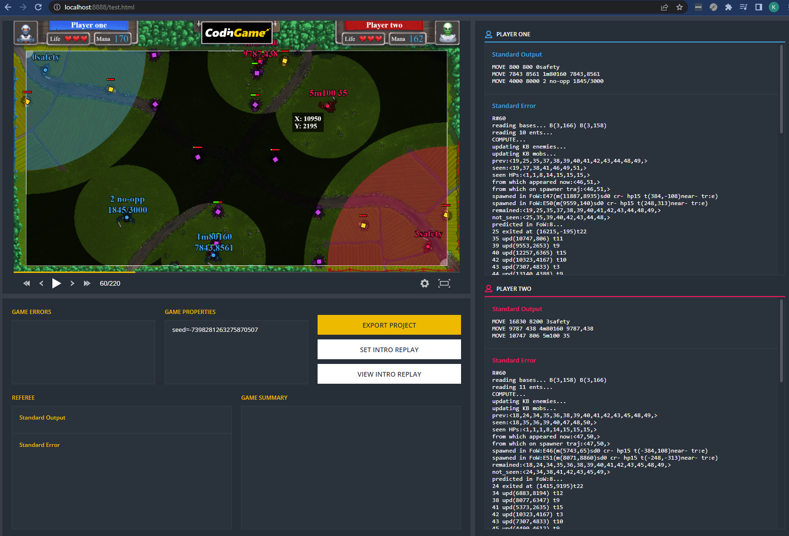

# About
I cloned this repo to experiment with local debugging of agents. Probably this is not the repo you are looking for. [See original here.](https://github.com/CodinGame/SpringChallenge2022)

This is an example. You will need to do something similar to the game you want to thinker with.



# Disclaimer
Use it on your own risk. There are absolutely no guaranties for anything. I created this experiment as a total beginner to Java and Maven. If Github allowed private forks, then this repository would not be public. I am pretty sure that the solutions I found are far from the best. You'll be screaming in horror if you are an experienced Java developer.

There are some issues here and there, e.g. rarely the agent doesn't get its input. Also rarely the GameRunner opens the agent in a console instead of capturing its streams. A restart helps in this cases.

# Todo
Figure out how to play against the CG provided boss. (Currently you can play against your own AIs.) Figure out the causes of the above issues.

# Is it worth the hassle?
No, in my opinion, but your mileage might vary.

Pros:
- You can debug your code in your favorite IDE with brakepoints, watches, etc.
- You can monitor its memory consumption. (Though on CG server it will differ somewhat.)
- Can be fun, sort of... if you enjoy suffering.

Cons:
- Requires lots of preparations.
- There are so many steps, that you will most likely need to delve into some parts of it.
- The debugging process itself is slow and not as straightforward as you'd hope. See below.

# Requirements
- npm
- [A modified version of CodinGame/codingame-game-engine](https://github.com/KhardanOne/codingame-game-engine) with removed time limits.

# Preparations
- Set up the league in the java code in Main.main().
- Set up the UI
    ```
    SpringChallenge2022\src\main\resources\view\`
    npm ci
    npm start
    ```
    npm must be kept running in the background all the time.

# How to debug
- Make your AI debugbreak when attached, otherwise it will finish way too fast. See the next chapter for a C++ example.
- Build your AI.
- Copy your AI to `AIs` folder with the name of `player1.exe`. Also copy the pdb with the same name. You might want to automate this. See the next chapter for a CMake example.
- Copy the same exe (or another one) as `player2.exe`. Optionally copy a pdb.
- In VSCode browse to Main.java and click run over main(). The first time you'll need to create a simple launch.json file.
- Now the player1.exe and player2.exe processes are running but not visible.
- In Visual Studio -> Debug -> Attach to process -> player1.exe or player2.exe.
- The game will end in a few seconds without any visible output.
- Switch to VSCode and wait for `Exposed web server dir` message (a few tens of seconds).
- Open / refresh http://localhost:8888/test.html in Chrome to see the replay.

If something needs debugging, remember the turn number, add a breakpoint to your code (e.g. DebugBreak()) and run it again. But first kill all terminals in VSCode.

# Miscellaneous
You might want to debugbreak right after a successfull attach. On Windows something similar can work:
```C++
#ifdef _WIN32
#	include "windows.h"
#	include "winuser.h"
#	include "debugapi.h"
#	include "Libloaderapi.h"
#endif // _WIN32


void wait_for_debugger(const std::string& exe_name_ext) {
#ifdef _WIN32
	TCHAR szFileName[MAX_PATH];
	GetModuleFileName(NULL, szFileName, MAX_PATH);
	std::string file_name(szFileName);
	file_name = file_name.substr(file_name.find_last_of("/\\") + 1);
	if (file_name != exe_name_ext)
		return;

	std::cerr << "waiting for the debugger to attach..." << std::endl;
	while (!IsDebuggerPresent())
		Sleep(100);

	DebugBreak();
	std::cerr << " attached." << std::endl;
#endif // _WIN32
}
```


CMake example for copying build targets to the AI folder:
```CMake
set(COPY_EXE_PDB_AFTER_BUILD_TO "" CACHE PATH "A directory to copy the exe and pdb files to after a successful build. Optional.")

cmake_minimum_required(VERSION 3.14)
project(codingame)
set(CMAKE_CXX_STANDARD 17)

file (GLOB_RECURSE MY_HEADERS CONFIGURE_DEPENDS *.h* *.inc *.inl)
file (GLOB_RECURSE MY_SOURCE  CONFIGURE_DEPENDS *.c*)
add_executable(player1 ${MY_HEADERS} ${MY_SOURCE})

if (NOT "${COPY_EXE_PDB_AFTER_BUILD_TO}" STREQUAL "")
	set_target_properties(player1 PROPERTIES RUNTIME_OUTPUT_DIRECTORY ${COPY_EXE_PDB_AFTER_BUILD_TO}$<0:>)
	set_target_properties(player1 PROPERTIES VS_DEBUGGER_WORKING_DIRECTORY "${COPY_EXE_PDB_AFTER_BUILD_TO}")
endif()
```

# Troubleshooting
- Issue: when starting main() a new terminal opens.
    - Workaround: close it, close all VS terminals, then try again.
- Issue: the debugger attaches successfully but the game doesn't end in a few seoncds.
    - Workaround: same as above. Also check the Task Manager for stuck processes.

# More info
The official CG SDK documentation: https://www.codingame.com/playgrounds/25775/codingame-sdk-documentation/introduction
